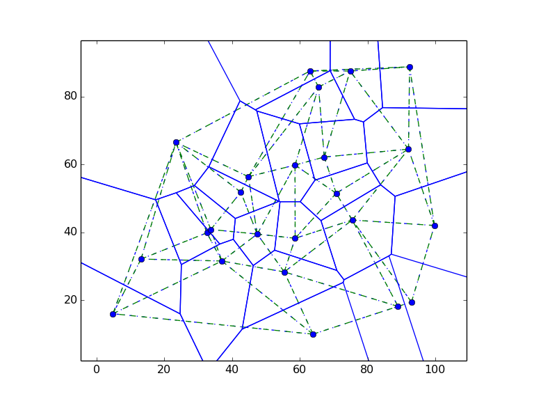

PyDelaunay2D
==============

A Simple Delaunay and Voronoi constructor in 2D. Written by [Jose M. Espadero](https://github.com/jmespadero/pyDelaunay2D)



Just pretend to be a simple and didactic implementation of the 
[Bowyer-Watson algorithm](https://en.wikipedia.org/wiki/Bowyer-Watson_algorithm)
to compute the [Delaunay triangulation](https://en.wikipedia.org/wiki/Delaunay_triangulation)
and the [Voronoi diagram](https://en.wikipedia.org/wiki/Voronoi_diagram) of a set o 2D points.

It is written in pure python + [numpy](http://www.numpy.org/) (tested with 
python2.7 and python3). A test example is provided showing how to call and 
plot the results using matplotlib.

It support the [robust inCircle2D predicate](https://www.cs.cmu.edu/~quake/robust.html)
from Jonathan Richard Shewchuk, but it is disabled by default due to perfomance
penalties, so do not expect to work on degenerate set of points.
If you really need to compute triangulation on big or degenerate set of points, 
try [scipy.spatial.Delaunay](https://docs.scipy.org/doc/scipy/reference/generated/scipy.spatial.Delaunay.html) 
instead.

## So why?
Mainly, to provide a didactic implementation of the algorithm. You can use:

``` python 
import numpy as np
from delaunay2D import Delaunay2D

# Create a random set of points
seeds = np.random.random((10, 2))

# Create delaunay Triangulation
dt = Delaunay2D()
for s in seeds:
    dt.AddPoint(s)

# Dump triangles 
print (dt.exportTriangles())
```
as a minimal example of build a triangulation and dump the triangles.

Also, because sometimes it is not possible to import the complete scipy.spatial
package (for example, when running a script inside of [blender](https://www.blender.org/) )

## Is it considered well-optimized?

No. The code has been written to be clear, not optimized. There is a section 
that performs specially bad: 

``` python
    # Search the triangle(s) whose circumcircle contains p 
    for T in self.triangles:
        if self.inCircle(T, p):
            bad_triangles.append(T)
```

There, we should avoid iterating the complete list of triangles. Best way is to 
use a structure that allows a spatial search (as a [QuadTree](https://en.wikipedia.org/wiki/Quadtree)). 
Then, continue the search over the neighbours of the initial search.

Despite that, it will compute DT of less than 1000 points in a reasonable time.

Again, just pretend to keep the code simple, didactic and with minimal dependencies.

## References:
* https://en.wikipedia.org/wiki/Bowyer-Watson_algorithm
* https://en.wikipedia.org/wiki/Delaunay_triangulation
* http://www.geom.uiuc.edu/~samuelp/del_project.html
* https://docs.scipy.org/doc/scipy/reference/generated/scipy.spatial.Delaunay.html
* https://www.cs.cmu.edu/~quake/robust.html
